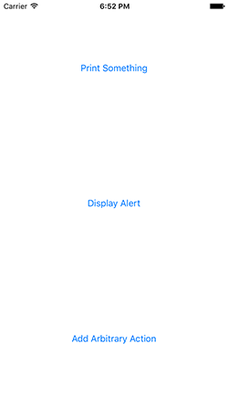
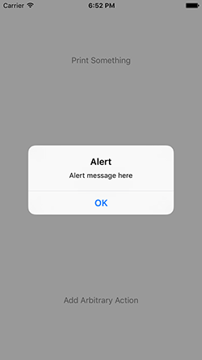

# MultiActionDemoViewController

There really isn't much to it—just a simple view controller subclass that allows you to
add `Action`s as you see fit.  I get tired of creating the same boilerplate code over and
over when I'm prototyping small things, so this takes that out of the equation.

An `Action` is merely a closure that will be invoked when the button is clicked. Just be
careful to use `[weak self]` if you're referencing anything on the owning object.

## Screenshots





## Example

To run the example project, clone the repo, and run `pod install` from the Example directory first.

## Requirements

## Installation

MultiActionDemoViewController is available through [CocoaPods](http://cocoapods.org). To install
it, simply add the following line to your Podfile:

```ruby
pod "MultiActionDemoViewController"
```

## Author

Jonathon Staff, jon@nplexity.com

## License

MultiActionDemoViewController is available under the MIT license. See the LICENSE file for more info.
